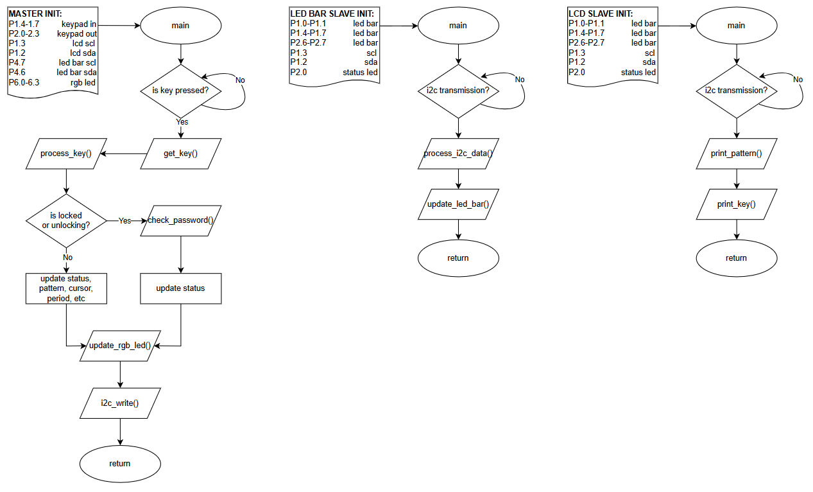
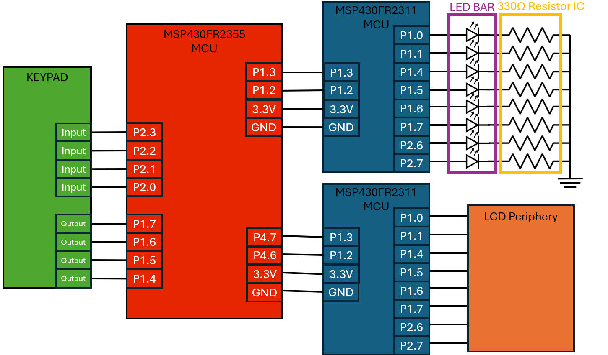
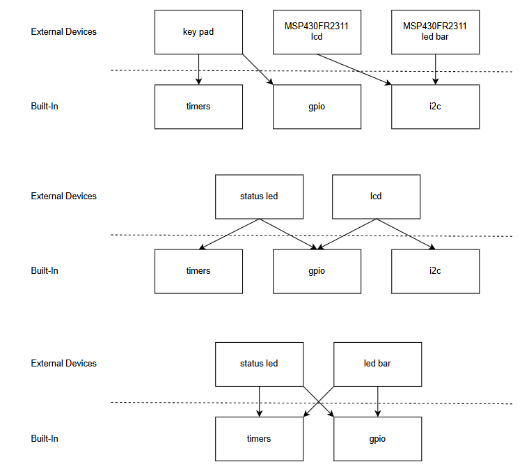

# Project 4 - Demo

## Team Members
Jay Graham, Kyle Stopplecamp

## Introduction
This project involved building a multi-MCU embedded system where a controller (MSP430FR2355) communicates via I2C with two peripheral MCUs (MSP430FR2310) to control an LED bar and an LCD. The controller reads input from a 16-button keypad, requiring an unlock code before allowing user interaction. Once unlocked, keypad inputs are used to select LED patterns and update LCD displays, with real-time feedback through RGB indicators and status LEDs. The system emphasizes modular design, proper I2C communication, and the ability to program standalone MSP430 devices.

### High-Level Flowcharts

### Circuit Diagram

### Software Architecture

## DEMO
Done with TA or Trevor on 3/27/25

## Review of Results
| Requirement/specification                                                                                | Points | Jay       | Kyle      |
|----------------------------------------------------------------------------------------------------------|--------|-----------|-----------|
| **Presentation**                                                                                         |        |           |           |
| Introduction                                                                                             | 1      |    1      |           |
| Circuit diagram                                                                                          | 2      |    2      |           |
| System architecture diagram                                                                              | 2      |    2      |           |
| Controller high-level flowchart                                                                          | 1      |    1      |           |
| LED peripheral high-level flowchart                                                                      | 1      |    1      |           |
| LCD peripheral high-level flowchart                                                                      | 1      |    1      |           |
| Professional demo                                                                                        | 2      |    2      |           |
| **LED Patterns**                                                                                         |        |           |           |
| LED patterns work correctly                                                                              | 1      |    1      |           |
| **LCD Display**                                                                                          |        |           |           |
| LCD is blank when the system is locked                                                                   | 0.5    |           |    0.5    |
| LCD displays current keypress when unlocked                                                              | 1      |           |    1      |
| LCD displays  LED pattern name                                                                           | 2      |           |    2      |
| Pressing “C” toggles the cursor state (on or off)                                                        | 1      |           |    1      |
| Pressing “9” toggles the cursor’s blink state (blinking or not blinking)                                 | 1      |           |    1      |
| **Main controller**                                                                                      |        |           |           |
| System must have a status indicator that indicates whether system is locked, being unlocked, or unlocked | 0.5    |    0.5    |           |
| The system should respond quickly to a key press                                                         | 1      |    1      |           |
| The system must communicate to the LED peripheral when a pattern button is pressed                       | 2      |    2      |           |
| The system must communicate to the LCD peripheral when any key is pressed                                | 2      |    2      |           |
| **LED bar peripheral**                                                                                   |        |           |           |
| Status indicator must indicate when the system has received data                                         | 0.25   |    0.25   |           |
| Status indicator must indicate when the system has not received data for some time                       | 0.25   |    0.25   |           |
| System must be controlled via i2c                                                                        | 2      |    2      |           |
| **LCD peripheral**                                                                                       |        |           |           |
| Status indicator must indicate when the system has received data                                         | 0.25   |           |    0.25   |
| Status indicator must indicate when the system has not received data for some time                       | 0.25   |           |    0.25   |
| System must be controlled via i2c                                                                        | 2      |           |    2      |
| System must be able to write characters to all 32 segments                                               | 4      |           |    4      |
| System must be able to write all characters between 00100011 and 01111111 in the Character Font Table    | 4      |           |    4      |
| LCD contrast is adjustable                                                                               | 2      |           |    2      |
| LCD must be able to be cleared                                                                           | 1      |           |    1      |
| LCD cursor can be turned off and on                                                                      | 1      |           |    1      |
| LCD cursor’s blink functionality can be turned off and on                                                | 1      |           |    1      |
| Total                                                                                                    | 40     |    19     |    21     |